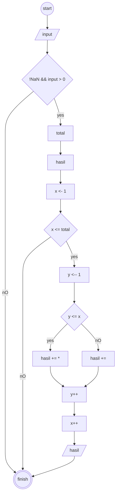

# algoritma flowchart foor loop

```mermaid
    flowchart TB
    start((start))
    init1["total"]
    input[/"input"/]
    check{"!NaN && input > 0"}
    init2["hasil"]
    init3["x <- 1"]
    check2{"x <= total"}
    increment["x++"]
    init4["y <-- 1"]
    check3{y <= x}
    result1["hasil += *"]
    result2["hasil += \n"]
    increment["x++"]
    increment2["y++"]
    finalResult[/"hasil"/]

    finish(((finish)))


    start --> input
    input --> check
    check --yes--> init1
    check --nO--> finish
    init1 --> init2
    init2 --> init3
    init3 --> check2
    check2 --yes--> init4
    check2 --nO--> finish
    init4 --> check3
    check3 --yes--> result1
    check3 --nO--> result2
    result1 & result2 --> increment2
    increment2 --> increment
    increment --> finalResult
    finalResult --> finish
```
